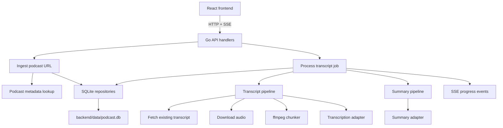

# Podcast Summarizer

Local-first podcast ingestion and summarization app built as a portfolio project. The backend is Go with clean architecture boundaries, SQLite persistence, HTTP APIs, and SSE streaming. The frontend is Vite + React + TypeScript.

The default path is intentionally simple: run it on one machine, store data in `backend/data/podcast.db`, and keep generated audio artifacts under `backend/data/storage`.

## What it demonstrates
- End-to-end podcast workflow: ingest a podcast URL, fetch metadata, stream transcription progress, summarize aligned transcript paragraphs, and export results.
- Local-first persistence with SQLite as the only database runtime.
- Streaming UX via Server-Sent Events from Go to React.
- Adapter boundaries for transcription, summarization, media chunking, local artifact storage, and podcast metadata lookup.

## Architecture



## Project layout
- `backend/`: Go services, adapters, infra, and jobs; entrypoint at `cmd/server`.
- `frontend/`: Vite SPA, pages/components/hooks/services; talks to the backend API.
- `compose.yaml`: Two-service local Docker demo for the backend and frontend.
- `DEPLOYMENT.md`: Local and Docker demo runbook for portfolio review.
- `specs/`: planning artifacts.

## Prerequisites
- Go 1.25+
- Node 20+ and npm
- ffmpeg on PATH (set `FFMPEG_PATH` if not simply `ffmpeg`)
- Optional for the packaged demo: Docker with the Compose plugin

## Quickstart

From a fresh checkout, run the recovery check first. This is the deterministic no-key verification path:

```bash
./init.sh
```

It verifies the harness, backend tests, frontend tests/build, and a local SQLite backend smoke check without requiring `OPENAI_API_KEY`.

1. Start the backend:

   ```bash
   cd backend
   cp .env.example .env
   make run
   ```

2. Start the frontend in another terminal:

   ```bash
   cd frontend
   npm ci
   npm run dev -- --host
   ```

3. Open the Vite dev URL, submit a podcast URL, and watch the transcript stream in.

Local data is created under `backend/data/` and ignored by git.
Generated media files, such as downloaded audio and ffmpeg chunks, are stored under `backend/data/storage/` in local mode and are also ignored by git.
SQLite records episode metadata, processing jobs, audio chunks, transcript segments, summary segments, and transcript-to-summary mappings in `backend/data/podcast.db` unless `SQLITE_PATH` points elsewhere.

Without `OPENAI_API_KEY`, the app runs in deterministic demo mode: tests and smoke checks use local fixtures or stub adapters, and the backend never attempts a live OpenAI request. Set `OPENAI_API_KEY` only when you want real transcription and summarization for submitted podcast audio.

## Docker Demo

The packaged demo starts only the local backend and frontend:

```bash
./scripts/verify-docker-demo.sh --keep-running
```

The script builds both images with Docker Compose, starts the API on `http://localhost:8080`, starts the frontend on `http://localhost:8081`, verifies both health endpoints plus the podcast list API, and leaves the containers running when `--keep-running` is supplied. Run `docker compose down` when finished.

The Compose workflow mounts `./backend/data` into the backend container so the SQLite database and generated audio artifacts survive container restarts.

## Backend (Go)
1) Copy `backend/.env.example` to `backend/.env` and fill any optional values (never commit secrets).
2) From `backend/`:
   - Run: `make run` (loads `.env` then `go run ./cmd/server`, defaults to `:8080`)
   - Test: `make test` (or `go test ./...`)
   - Lint: `make lint` (requires golangci-lint installed)

Key env vars (`backend/src/config/config.go`):
- `SQLITE_PATH`: defaults to `data/podcast.db`.
- `API_BASE_URL` (public base for building links)
- `FFMPEG_PATH`
- OpenAI: `OPENAI_API_KEY`, `OPENAI_TRANSCRIBE_MODEL`, `OPENAI_SUMMARIZE_MODEL`. When the key is set, OpenAI is selected before custom HTTP adapters; `OPENAI_TRANSCRIBE_MODEL` defaults to `whisper-1`.
- Optional custom HTTP adapters: `TRANSCRIBE_URL`, `TRANSCRIBE_KEY`, `SUMMARIZE_URL`, `SUMMARIZE_KEY`.
- `LOCAL_STORAGE_PATH`: stores generated audio/chunk artifacts under `data/storage` by default.

## Frontend (Vite + React)
From `frontend/`:
- Install deps: `npm ci`
- Dev server: `npm run dev -- --host`
- Type-check + build: `npm run build`
- Lint: `npm run lint`
- Test: `npm test` (Vitest + jsdom)

## Demo Packaging
For a resume/demo project, the recommended story is local execution or single-machine Docker. The included Compose file packages only the backend, frontend, SQLite database path, and local storage directory.

See `DEPLOYMENT.md` for:
- Local demo commands
- Docker Compose commands
- A lightweight portfolio demo checklist

## Contributing / workflow
- Keep backend/frontend changes in sync via the monorepo.
- Favor feature branches, PRs, and CI that runs `npm test && npm run lint` (frontend) plus `go test ./...` (backend).
- Do not commit `.env` files or secrets. 
- Do not commit local SQLite database files or generated local storage artifacts; they are ignored via `.gitignore`.
